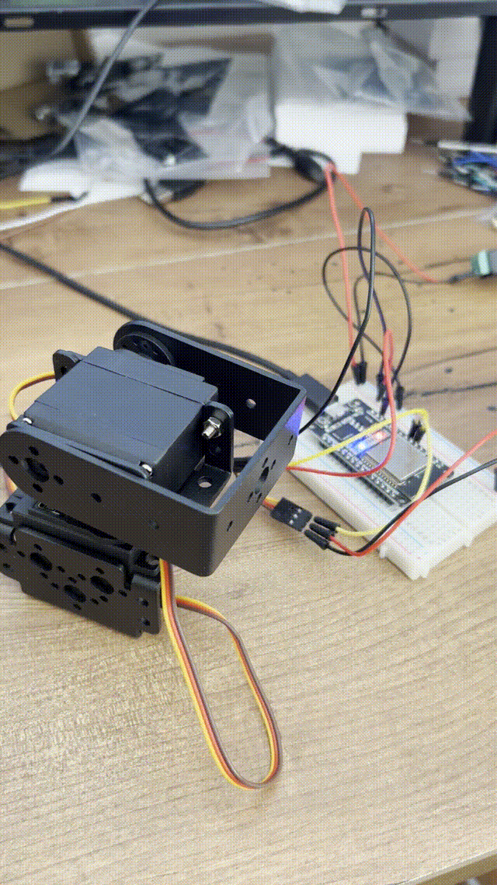

# maya-firmware

## Overview
This project is a Zephyr-based firmware for ESP32 (PRO CPU).

### Hardware

- ESP32 module running Zephyr OS
- 2 x MG995 Servo Motors
- DEVMO 5V Laser Transmitter 650 nm
- 5V power supply

## Prerequisites
- Zephyr Project (recommended version: 4.2.0 or newer)
- Python 3.10 or newer
- west (Zephyr's meta-tool)
- CMake (minimum version: 3.20.0)
- ESP32 DevKitC hardware

Follow the [Zephyr Project Getting Started Guide](https://docs.zephyrproject.org/latest/getting_started/index.html) for environment setup and tool installation.

## Building
To build the firmware for ESP32 (PRO CPU), run:
```sh
west build -p always -b esp32_devkitc/esp32/procpu
```

## Flashing
To flash the device, run:
```sh
west flash
```

## Project Structure
- `src/main.c`: Main application source file
- `CMakeLists.txt`: CMake configuration (requires CMake >= 3.20.0)
- `prj.conf`: Project configuration

## Versioning
- The app version is set via the `APP_VERSION_STRING` variable in CMake.
- See the `VERSION` file for the current firmware version.

## Notes
- Ensure your Zephyr environment variables (e.g., `ZEPHYR_BASE`) are set correctly.
- This project targets the ESP32 PRO CPU. Adjust the board argument if using a different ESP32 variant.
- For troubleshooting, consult the Zephyr documentation and community forums.

## Demo
